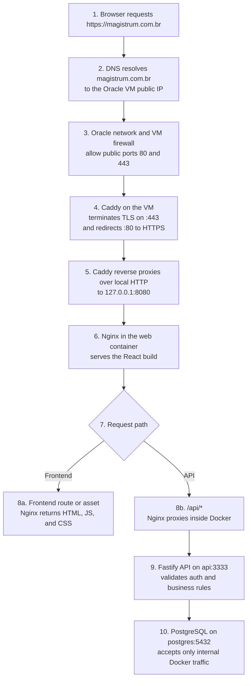

# Production deployment

Production uses `compose.prod.yml`, which is separate from the development Compose. It builds the API, serves the web build through Nginx, runs pending Prisma migrations before starting the API, and keeps PostgreSQL private inside the Compose network.

## Automatic deployment

Pushes to `main` deploy through the GitHub environment `oracle-vm`. Configure these environment values under **Settings > Environments > oracle-vm**:

| Type | Name | Value |
| --- | --- | --- |
| Variable | `ORACLE_VM_HOST` | VM public IP or DNS name |
| Variable | `ORACLE_VM_USER` | SSH user, usually `ubuntu` |
| Variable | `ORACLE_VM_DEPLOY_PATH` | Absolute repository path, for example `/home/ubuntu/jurisflow` |
| Secret | `ORACLE_VM_SSH_KEY` | Private SSH key accepted by the VM |
| Secret | `ORACLE_VM_KNOWN_HOSTS` | Output of `ssh-keyscan -H <host>` verified against the VM host key |

The deployment directory must already contain the repository and a valid `.env.prod`. The SSH user must be able to pull `main` and run Docker Compose without an interactive password. Node.js and npm are not required on the VM; environment validation runs through the Node Docker image.

## Request flow



Only Caddy is public. The web port is bound to the VM loopback interface, while the API and PostgreSQL expose no host ports:

| Layer | Address | Exposure | Responsibility |
| --- | --- | --- | --- |
| DNS | `magistrum.com.br` | Public | Points the domain to the Oracle VM. |
| Caddy | VM ports `80` and `443` | Public | Manages HTTPS certificates, redirects HTTP, and forwards requests. |
| Web/Nginx | `127.0.0.1:8080` on the VM, container port `80` | VM only | Serves React and proxies `/api/*`. |
| API | `api:3333` | Docker network only | Runs authentication and application rules. |
| PostgreSQL | `postgres:5432` | Docker network only | Stores application data. |

The Nginx system service on the VM must remain disabled because Caddy owns public ports `80` and `443`. Nginx is still used inside the `web` container.

## Security rules

- Production deployment is blocked while `.env.prod` contains placeholders, database passwords shorter than 32 URL-safe characters, a JWT secret shorter than 64 characters, or a non-HTTPS application origin.
- The PostgreSQL administrator and application users must be different.
- The application database role is not a superuser and cannot create databases, roles, or replication slots.
- PostgreSQL has no published host port. Administrative access must use `docker compose exec` or an SSH tunnel.
- TLS must terminate at the hosting provider or a reverse proxy in front of `WEB_PORT`. The included Nginx container only handles internal HTTP.
- `.env.prod` is ignored by Git. Restrict it to the deployment user with `chmod 600 .env.prod` on Linux.

## Rotate credentials in an existing database

Back up the database first:

```bash
docker compose --env-file .env.prod -f compose.prod.yml exec -T postgres \
  sh -c 'pg_dump -U "$POSTGRES_USER" -d "$POSTGRES_DB" -Fc' > magistrum.backup
```

Generate new values with `openssl rand -hex 32`. Open `psql` as the current administrator:

```bash
docker compose --env-file .env.prod -f compose.prod.yml exec postgres \
  psql -U CURRENT_ADMIN_USER -d magistrum
```

Use interactive password prompts so secrets do not enter shell history:

```text
\password magistrum_admin
\password magistrum_app
```

Update the matching values in `.env.prod`, validate, and recreate the services:

```bash
npm run prod:config
docker compose --env-file .env.prod -f compose.prod.yml up -d --force-recreate api migrate
```

## Change PostgreSQL usernames

For a new, empty deployment, set `POSTGRES_ADMIN_USER` and `POSTGRES_APP_USER` before the first `prod:up`.

For an existing volume, changing `.env.prod` alone does nothing. Renaming the administrator is risky because health checks and ownership may still reference it. Prefer creating a replacement administrator, testing it, and disabling the old login:

```sql
CREATE ROLE new_admin WITH LOGIN SUPERUSER PASSWORD 'temporary-password';
```

Reconnect as `new_admin`, set its final password with `\password new_admin`, update `.env.prod`, recreate the PostgreSQL service, verify health, and only then run:

```sql
ALTER ROLE old_admin NOLOGIN;
```

To rename the application role, stop the API, connect as administrator, and run:

```sql
ALTER ROLE old_app_user RENAME TO new_app_user;
```

Set its password with `\password new_app_user`, update `POSTGRES_APP_USER` and `POSTGRES_APP_PASSWORD`, then start migration and API services again. Existing objects remain owned by the renamed role.

## Operations

```bash
docker compose --env-file .env.prod -f compose.prod.yml ps
docker compose --env-file .env.prod -f compose.prod.yml logs -f api web
docker compose --env-file .env.prod -f compose.prod.yml exec postgres \
  sh -c 'psql -U "$POSTGRES_USER" -d "$POSTGRES_DB"'
```
